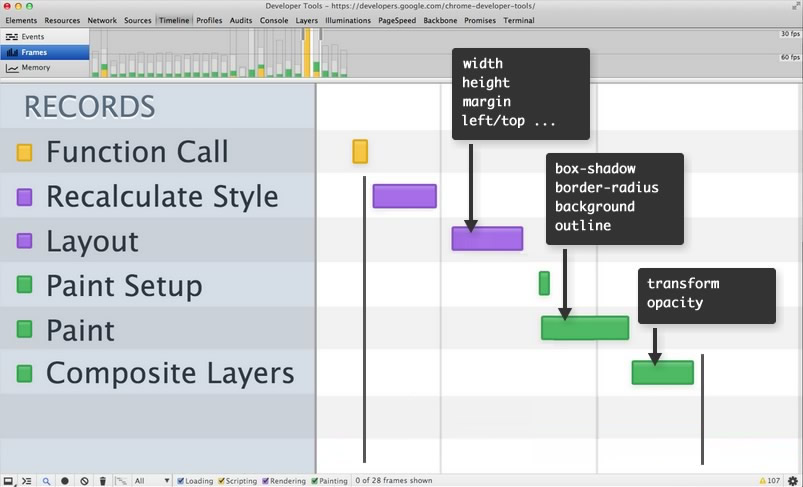

# CSS3/animation

## 1. WHAT?

## 2. Why?
*From DOM to Pixels in DevTools, the process that the browser goes through:*

### a.Recalculate Style
calculate the styles that apply to the elements
 
### b.Layout
generate the geometry(position and size) and position for each element

### c.Paint Setup and Paint
fill out the pixels for each element into layers
Composite Layers

### d.draw thie layers out to screen

**To achieve silky smooth animations you need to avoid work, and the best way to do that is to only change properties that affect compositing -- transform and opacity.**

The higherup you start on thie timeline waterfall the more work the browser has to do to get pixels on to the screen.

# 3.Conclusion

### a.style affect layout

### b.style affect paint
